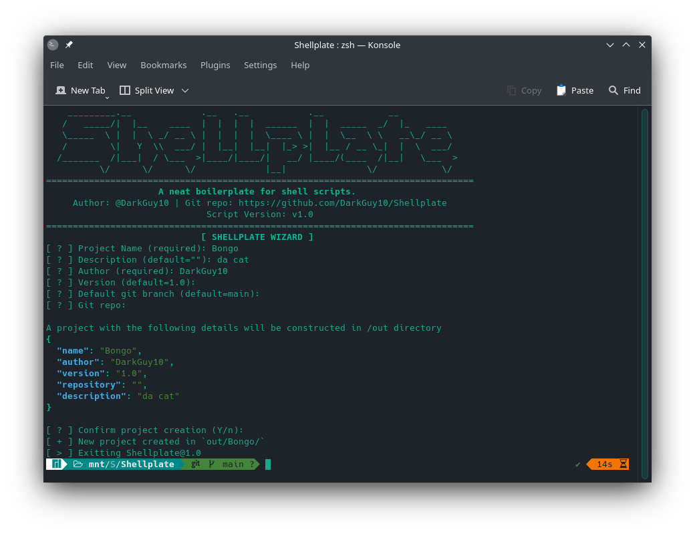
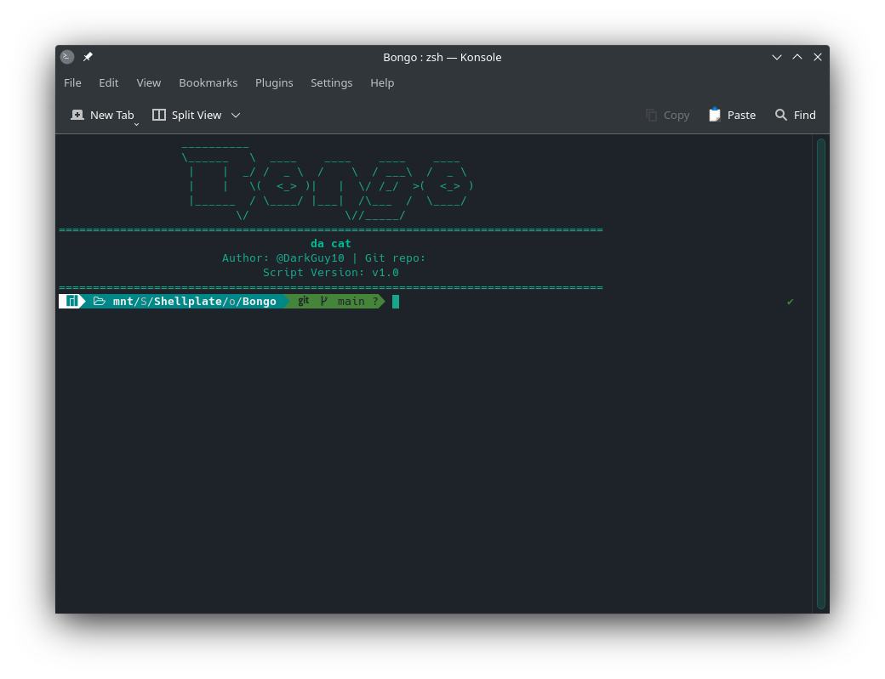

# Shellplate
## _A custom boilerplate for shell scripts_
This boilerplate does not cover advanced scripting, but focuses more on automating a neat UI/UX for shell scripts. <br>
As someone who occassionally creates shell scripts I made this oriented for self use, so feel free to edit all/any part of the code to match your own styles. <br>
_If you do use this code, please give me some credit in the repo :)_ <br>

## Features
- Neatly designed UI/UX
- Stores project data in a JSON file (`project.json`)
- Built-in dependency checker

## Demo
You can find an example script built using Shellplate in the `/example` directory. <br>
_Shellplate in use:_


_An example script built using Shellplate:_


## Dependencies
Shellplate depends on the following packages which need to be installed manually depending on your platform.
```
git
jq
curl
tput
fmt
figlet
```
These can also be found in `requirements.txt`

## How to use
1. Open a terminal, clone this repo and cd into the Shellplate directory
    ```bash
    git clone https://github.com/DarkGuy10/Shellplate.git
    cd Shellplate
    ```
2. Execute the `Shellplate.sh` script and follow the interactive wizard
    ```bash
    bash Shellplate.sh
    ```
3. If during the dependency check, any of the packages are marked `UNMET`, manually install them and rerun the script.
4. Your project is created at `out/<ProjectName>/`. Open the `<ProjectName>.sh` file in the directory and place your code in the `main()` function.
5. Happy scripting!

## Features in development
- Support for custom and prebuilt ANSII-based UI color schemes
- Built-in script updater
- Single script-file projects
- Script flags to skip the interactive wizard

## Documentation
### Project structure
```
<ProjectName>/
    ascii_art.txt
    <ProjectName>.sh
    project.json
    README.md
    requirements.txt
```
- `ascii_art.txt` - A banner art for the project created using `figlet`
- `<ProjectName>.sh` - This is the main script file. Put your code inside the `main()` function
- `project.json` - Contains basic info about the project. It follows the following template:
    ```json
    {
      "name": "",
      "version": "",
      "author": "",
      "repository": "",
      "description": ""
    }
    ```
- `README.md` - The readme file of the project.
- `requirements.txt` - Contains a list of packages which the script depends to run.
**NOTE**  : Do not remove `jq` and `tput` from `requirements.txt`. They are important for the boilerplate itself.

### UI/UX Utils
By default the `<ProjectName>.sh` script file contains a few utility functions for easier UI/UX management.
- `pretty_banner` - clears the screen and prints a banner showing project name ASCII art and other details
- `centre "some text"` - Print some text in centre of a region of 80 columns (80 is the maximum number of columns in the UI)
- `header "some title"` - Print a bold header in centre, bounded by `[]`

## Changelog
Changelog can be found [here](CHANGELOG/).
